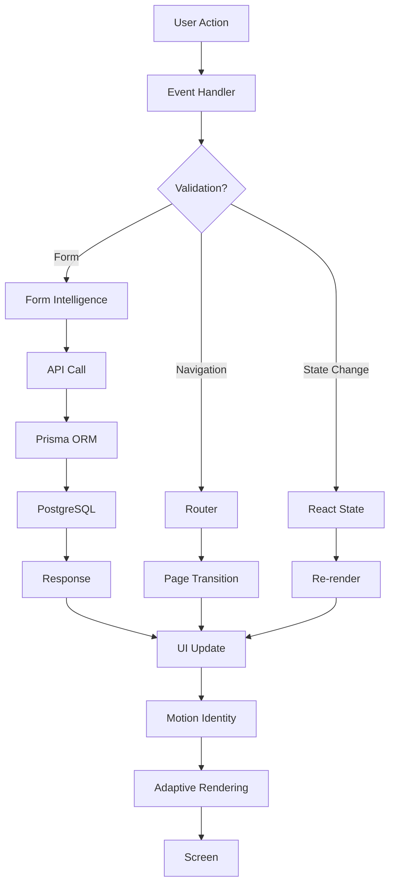
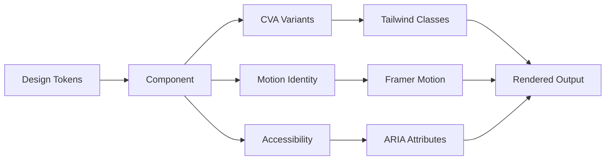
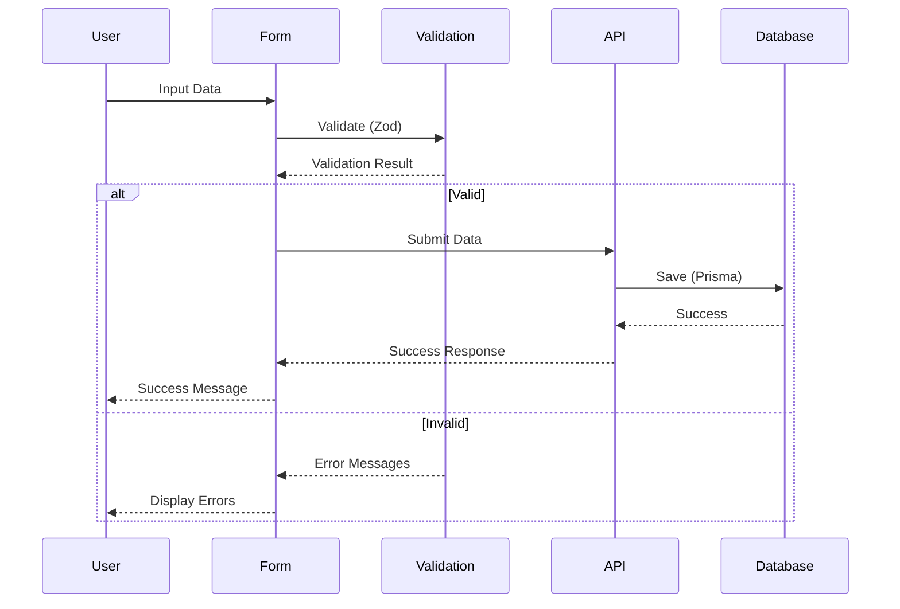

# Canonstrata Architecture

## System Overview

Canonstrata is an enterprise-grade design system built on Next.js 16, featuring a signature motion identity, invariant enforcement, adaptive rendering, and form intelligence. The system is designed for scale, performance, and maintainability.

## Technology Stack

```
┌─────────────────────────────────────────────────────────────┐
│                    PRESENTATION LAYER                       │
├─────────────────────────────────────────────────────────────┤
│  Next.js 16  │  React 19  │  TypeScript 5.9  │  Tailwind 4 │
├─────────────────────────────────────────────────────────────┤
│                    COMPONENT LAYER                          │
├─────────────────────────────────────────────────────────────┤
│  Radix UI  │  Framer Motion  │  CVA  │  React Hook Form    │
├─────────────────────────────────────────────────────────────┤
│                    SYSTEM LAYER                             │
├─────────────────────────────────────────────────────────────┤
│  Invariant Enforcement  │  Motion Identity  │  Rendering    │
├─────────────────────────────────────────────────────────────┤
│                    DATA LAYER                               │
├─────────────────────────────────────────────────────────────┤
│  Prisma ORM  │  PostgreSQL  │  NextAuth  │  Zod Validation │
└─────────────────────────────────────────────────────────────┘
```

## Core Principles

### 1. Invariant Enforcement

**Purpose**: Guarantee system-level constraints at runtime and build-time.

**Implementation**: `src/lib/invariants/`

**Key Features**:
- Design token validation
- Component contract enforcement
- Type safety guarantees
- Runtime assertion system

### 2. Signature Motion Identity

**Purpose**: Create instantly recognizable Canonstrata UI through motion alone.

**Implementation**: `src/lib/motion-identity/`

**Signature Animations**:
- `canostrataReveal` - Signature reveal pattern
- `canostrataDrawer` - Drawer/slide animations
- `canostrataRipple` - Interactive ripple effects
- `canostrataStagger` - Orchestrated staggered animations
- `canostrataLift` - Elevation changes
- `canostrataGlow` - Focus/highlight effects

### 3. Adaptive Rendering

**Purpose**: Optimize rendering based on device capabilities and user preferences.

**Implementation**: `src/lib/rendering/`

**Modes**:
- **Performance Mode**: Reduced animations, optimized rendering
- **Standard Mode**: Full feature set
- **Enhanced Mode**: Maximum visual fidelity
- **Accessibility Mode**: Motion reduced, high contrast

### 4. Form Intelligence

**Purpose**: Smart form state management with validation and accessibility.

**Implementation**: `src/lib/form-intelligence/`

**Features**:
- Auto-validation
- Smart error messages
- Accessibility integration
- State persistence
- Multi-step form management

## Directory Structure

```
/Users/henryherrera/MAIN
├── .github/workflows/          # CI/CD pipelines
│   └── ci.yml                  # Main CI workflow
├── .storybook/                 # Storybook configuration
│   ├── enforcement/            # Gatekeeper rules
│   ├── main.ts                 # Storybook config
│   └── preview.ts              # Story preview config
├── cli/                        # CLI tools
│   └── canonstrata.js          # System introspection CLI
├── design-system/              # Design tokens and contracts
│   ├── tokens/                 # Design tokens
│   ├── motion/                 # Motion specifications
│   └── interaction-contracts/  # Interaction patterns
├── docs/                       # Documentation
│   ├── TESTING.md              # Testing strategy
│   ├── CLI_USAGE.md            # CLI documentation
│   └── STORYBOOK_GATEKEEPER.md # Gatekeeper guide
├── prisma/                     # Database schema
│   └── schema.prisma           # Prisma schema
├── public/                     # Static assets
├── scripts/                    # Build and utility scripts
│   ├── ci-validate.ts          # CI validation
│   ├── clean-artifacts.ts      # Artifact cleanup
│   └── pre-commit-validate.ts  # Pre-commit checks
├── src/                        # Source code
│   ├── app/                    # Next.js App Router
│   ├── components/             # React components
│   │   ├── ui/                 # Base UI components
│   │   ├── forms/              # Form components
│   │   ├── layout/             # Layout components
│   │   ├── motion/             # Motion components
│   │   └── __tests__/          # Component tests
│   ├── lib/                    # Libraries and utilities
│   │   ├── invariants/         # Invariant enforcement
│   │   ├── motion-identity/    # Motion system
│   │   ├── rendering/          # Adaptive rendering
│   │   ├── form-intelligence/  # Form intelligence
│   │   ├── a11y/               # Accessibility utilities
│   │   ├── performance/        # Performance optimization
│   │   └── utils/              # General utilities
│   ├── styles/                 # Global styles
│   └── types/                  # TypeScript types
└── tests/                      # Test suites
    ├── e2e/                    # End-to-end tests
    └── visual/                 # Visual regression tests
```

## Component Architecture

### Component Structure

Every component follows this pattern:

```typescript
// 1. Imports
import * as React from 'react';
import { cva, type VariantProps } from 'class-variance-authority';
import { cn } from '@/lib/utils/cn';

// 2. Variants (CVA)
const componentVariants = cva(
  'base-classes',
  {
    variants: {
      variant: {
        default: 'variant-classes',
        // ...
      },
      size: {
        sm: 'size-classes',
        // ...
      },
    },
    defaultVariants: {
      variant: 'default',
      size: 'md',
    },
  }
);

// 3. Type Definitions
export interface ComponentProps
  extends React.HTMLAttributes<HTMLElement>,
    VariantProps<typeof componentVariants> {
  // Custom props
}

// 4. Component Implementation
export const Component = React.forwardRef<HTMLElement, ComponentProps>(
  ({ className, variant, size, ...props }, ref) => {
    return (
      <element
        ref={ref}
        className={cn(componentVariants({ variant, size }), className)}
        {...props}
      />
    );
  }
);

Component.displayName = 'Component';
```

## Data Flow

### User Interaction Flow



### Component Interaction Flow



### Form Submission Flow



## State Management

### Local State (React Hooks)

```typescript
// Component state
const [state, setState] = useState(initialState);

// Side effects
useEffect(() => {
  // Effect logic
}, [dependencies]);

// Memoization
const memoizedValue = useMemo(() => computation(), [deps]);
```

### Form State (React Hook Form)

```typescript
import { useForm } from 'react-hook-form';
import { zodResolver } from '@hookform/resolvers/zod';

const form = useForm({
  resolver: zodResolver(schema),
  defaultValues: {},
});
```

### Server State (Next.js)

```typescript
// Server Components (default)
async function ServerComponent() {
  const data = await fetchData();
  return <div>{data}</div>;
}

// Client Components
'use client';
export function ClientComponent() {
  const [data, setData] = useState(null);
  // Client logic
}
```

## Routing

### App Router Structure

```
src/app/
├── layout.tsx              # Root layout
├── page.tsx                # Home page
├── (auth)/                 # Auth group
│   ├── login/
│   │   └── page.tsx
│   └── signup/
│       └── page.tsx
├── dashboard/
│   ├── layout.tsx          # Dashboard layout
│   └── page.tsx
└── api/                    # API routes
    ├── auth/
    │   └── [...nextauth]/
    │       └── route.ts
    └── users/
        └── route.ts
```

### Navigation

```typescript
import { useRouter } from 'next/navigation';

const router = useRouter();

// Navigate
router.push('/dashboard');

// Replace
router.replace('/login');

// Refresh
router.refresh();
```

## API Layer

### Route Handlers

```typescript
// src/app/api/users/route.ts
import { NextRequest, NextResponse } from 'next/server';
import { prisma } from '@/lib/prisma';

export async function GET(request: NextRequest) {
  const users = await prisma.user.findMany();
  return NextResponse.json(users);
}

export async function POST(request: NextRequest) {
  const body = await request.json();
  const user = await prisma.user.create({ data: body });
  return NextResponse.json(user);
}
```

### Server Actions

```typescript
'use server';

import { revalidatePath } from 'next/cache';
import { prisma } from '@/lib/prisma';

export async function createUser(formData: FormData) {
  const email = formData.get('email') as string;
  
  const user = await prisma.user.create({
    data: { email },
  });
  
  revalidatePath('/users');
  return user;
}
```

## Authentication

### NextAuth Configuration

```typescript
// src/app/api/auth/[...nextauth]/route.ts
import NextAuth from 'next-auth';
import { PrismaAdapter } from '@auth/prisma-adapter';
import { prisma } from '@/lib/prisma';

export const authOptions = {
  adapter: PrismaAdapter(prisma),
  providers: [
    // Providers configuration
  ],
  session: {
    strategy: 'jwt',
  },
};

const handler = NextAuth(authOptions);
export { handler as GET, handler as POST };
```

## Database Schema

### Prisma Schema

```prisma
// prisma/schema.prisma
generator client {
  provider = "prisma-client-js"
}

datasource db {
  provider = "postgresql"
  url      = env("DATABASE_URL")
}

model User {
  id            String    @id @default(cuid())
  email         String    @unique
  name          String?
  emailVerified DateTime?
  image         String?
  accounts      Account[]
  sessions      Session[]
  createdAt     DateTime  @default(now())
  updatedAt     DateTime  @updatedAt
}
```

## Performance Optimization

### Image Optimization

```typescript
import Image from 'next/image';

<Image
  src="/image.jpg"
  alt="Description"
  width={800}
  height={600}
  loading="lazy"
  placeholder="blur"
/>
```

### Code Splitting

```typescript
import dynamic from 'next/dynamic';

const HeavyComponent = dynamic(() => import('@/components/HeavyComponent'), {
  loading: () => <Loading />,
  ssr: false,
});
```

### Font Optimization

```typescript
import { Inter } from 'next/font/google';

const inter = Inter({ subsets: ['latin'] });

export default function RootLayout({ children }) {
  return (
    <html className={inter.className}>
      <body>{children}</body>
    </html>
  );
}
```

## Build Process

### Build Pipeline

```
┌──────────────┐
│   Source     │
└──────┬───────┘
       │
       ▼
┌──────────────┐
│  TypeScript  │  → Type checking
└──────┬───────┘
       │
       ▼
┌──────────────┐
│   Linting    │  → ESLint
└──────┬───────┘
       │
       ▼
┌──────────────┐
│   Testing    │  → Vitest + Playwright
└──────┬───────┘
       │
       ▼
┌──────────────┐
│   Build      │  → Next.js build
└──────┬───────┘
       │
       ▼
┌──────────────┐
│  Optimize    │  → Bundle analysis
└──────┬───────┘
       │
       ▼
┌──────────────┐
│   Deploy     │
└──────────────┘
```

## Monitoring & Observability

### Web Vitals Tracking

```typescript
// src/app/layout.tsx
import { Analytics } from '@/components/Analytics';

export default function RootLayout({ children }) {
  return (
    <html>
      <body>
        {children}
        <Analytics />
      </body>
    </html>
  );
}
```

### Performance Monitoring

```bash
npm run monitor:perf      # Performance metrics
npm run monitor:vitals    # Web Vitals
npm run monitor:bundle    # Bundle size
```

## Security

### Input Validation (Zod)

```typescript
import { z } from 'zod';

const userSchema = z.object({
  email: z.string().email(),
  password: z.string().min(8),
  name: z.string().optional(),
});

type User = z.infer<typeof userSchema>;
```

### CSRF Protection

Built-in with NextAuth and Next.js API routes.

### Environment Variables

```bash
# .env.local
DATABASE_URL="postgresql://..."
NEXTAUTH_SECRET="..."
NEXTAUTH_URL="http://localhost:3000"
```

## Deployment

### Build for Production

```bash
npm run build
npm run start:prod
```

### Environment Setup

See [DEPLOYMENT.md](./DEPLOYMENT.md) for detailed deployment instructions.

## Testing Architecture

See [TESTING.md](./TESTING.md) for comprehensive testing documentation.

## CLI Tools

See [CLI_USAGE.md](./CLI_USAGE.md) for CLI documentation.

## Related Documentation

- [Testing Strategy](./TESTING.md)
- [CLI Usage](./CLI_USAGE.md)
- [Storybook Gatekeeper](./STORYBOOK_GATEKEEPER.md)
- [Contributing Guide](./CONTRIBUTING.md)
- [Performance Guide](./PERFORMANCE.md)

## License

MIT License
